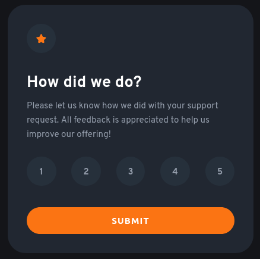
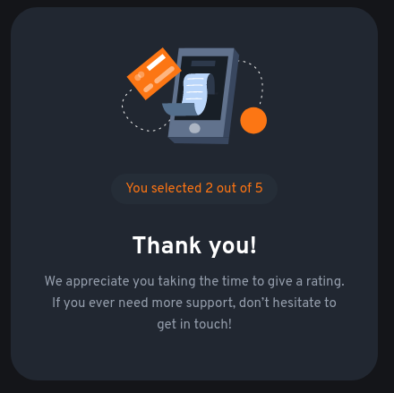

# Frontend Mentor - Interactive rating component solution

This is a solution to the [Interactive rating component challenge on Frontend Mentor](https://www.frontendmentor.io/challenges/interactive-rating-component-koxpeBUmI). Frontend Mentor challenges help you improve your coding skills by building realistic projects.

## Table of contents

- [Overview](#overview)
  - [The challenge](#the-challenge)
  - [Screenshot](#screenshot)
  - [Links](#links)
- [My process](#my-process)
  - [Built with](#built-with)
  - [What I learned](#what-i-learned)
  - [Continued development](#continued-development)
  - [Useful resources](#useful-resources)
- [Author](#author)
- [Acknowledgements](#acknowledgements)

## Overview

### The challenge

Users should be able to:

- View the optimal layout for the app depending on their device's screen size
- See hover states for all interactive elements on the page
- Select and submit a number rating
- See the "Thank you" card state after submitting a rating

### Screenshot

### Links

- Solution URL: [https://github.com/harnettd/interactive-rating-card](https://github.com/harnettd/interactive-rating-card)
- Live Site URL: [https://harnettd.github.io/interactive-rating-card/](https://harnettd.github.io/interactive-rating-card/)

## My process

### Built with

- HTML5
- CSS
- Flexbox

### What I learned

In completing this project, I learned how to

- work with flex containers and flex items in Flexbox
- hide an element using CSS with `display: none;`
- add event listeners to elements using Javascript.

### Continued development

- In this project, the layout that I set up using Flexbox was straightforward. I'd like to learn to use Flexbox to set up more complicated layouts.
- Near completion of this project, I stumbled across the `box-sizing: border-box;` property-value pair in CSS. In the future, I think that I'll use this combination when specifying paddings and widths of elements. 

### Useful resources

- [W3Schools CSS Flexbox](https://www.w3schools.com/csS/css3_flexbox.asp) - This helped me for XYZ reason. I really liked this pattern and will use it going forward.

## Author

- Github - [Derek Harnett](https://github.com/harnettd)
- Frontend Mentor - [@harnettd](https://www.frontendmentor.io/profile/harnettd)

## Acknowledgements

Thanks to [Frontend Mentor](https://www.frontendmentor.io/) for posting this challenge.